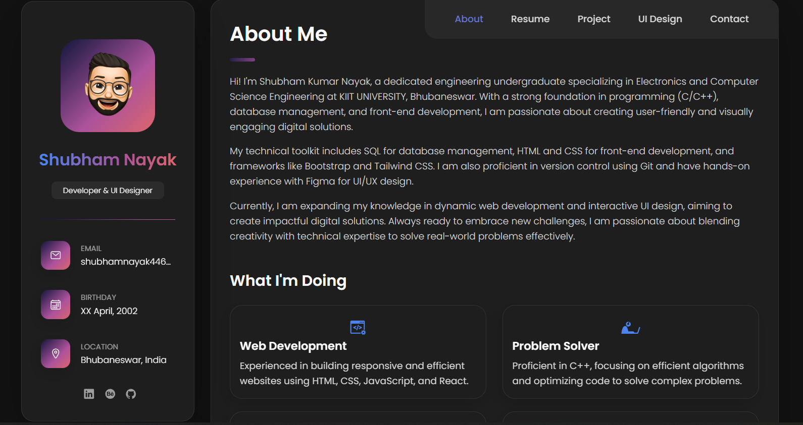

# Shubham Nayak's Portfolio


This is my personal portfolio website, built with React and Vite. It serves as a comprehensive showcase of my skills, projects, and experience in web development and UI design. The site is a responsive single-page application designed to be clean, modern, and user-friendly.

## Features

-   **About Me:** A detailed introduction, a summary of my services, and a showcase of my most significant projects.
-   **Interactive Resume:** Displays my education, experience, and animated skill bars representing my proficiency. Includes a direct download link for my PDF resume.
-   **Project Showcase:** A filterable gallery of my web development projects, with links to live demos.
-   **UI Design Gallery:** A collection of my UI/UX design work from Figma, categorized and filterable.
-   **Functional Contact Form:** An integrated contact form using EmailJS allows visitors to send messages directly to my inbox.
-   **Responsive Design:** A fully responsive layout that provides an optimal viewing experience across a wide range of devices, from mobile phones to desktops.
-   **Custom 404 Page:** A creatively designed "Not Found" page to handle invalid routes.

## Tech Stack

-   **Frontend:** React, Vite, HTML5, CSS3
-   **Routing:** React Router v6
-   **UI Components:** Material-UI (for form submission alerts)
-   **Icons:** Ionicons
-   **Services:** EmailJS (for contact form functionality)

## Getting Started

To get a local copy up and running, follow these simple steps.

### Prerequisites

-   Node.js (v18 or newer)
-   npm (or a compatible package manager like Yarn)

### Installation & Setup

1.  **Clone the repository:**
    ```sh
    git clone https://github.com/shubhamnayak14/my-portfolio.git
    ```

2.  **Navigate to the project directory:**
    ```sh
    cd my-portfolio
    ```

3.  **Install NPM packages:**
    ```sh
    npm install
    ```

4.  **Set up environment variables:**
    Create a `.env` file in the root of your project directory and add your EmailJS credentials. This is required for the contact form to function.
    ```env
    VITE_APP_EMAILJS_SERVICE_ID=your_service_id
    VITE_APP_EMAILJS_TEMPLATE_ID=your_template_id
    VITE_APP_EMAILJS_PUBLIC_KEY=your_public_key
    ```

5.  **Run the development server:**
    ```sh
    npm run dev
    ```
    The application will be available at `http://localhost:5173`.

## Available Scripts

In the project directory, you can run:

-   `npm run dev` or `npm start`: Runs the app in development mode.
-   `npm run build`: Builds the app for production to the `dist` folder.
-   `npm run lint`: Lints the codebase using ESLint to find and fix problems.
-   `npm run preview`: Starts a local static web server that serves the files from `dist` to preview the production build.
